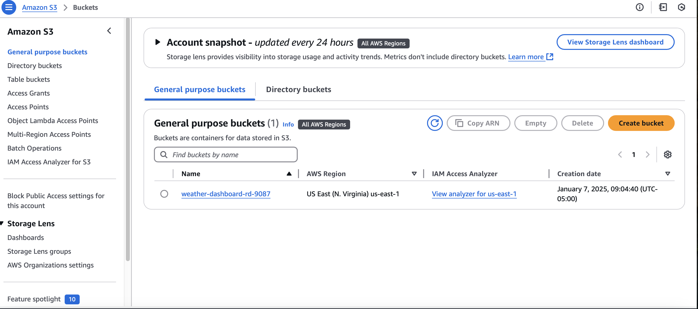
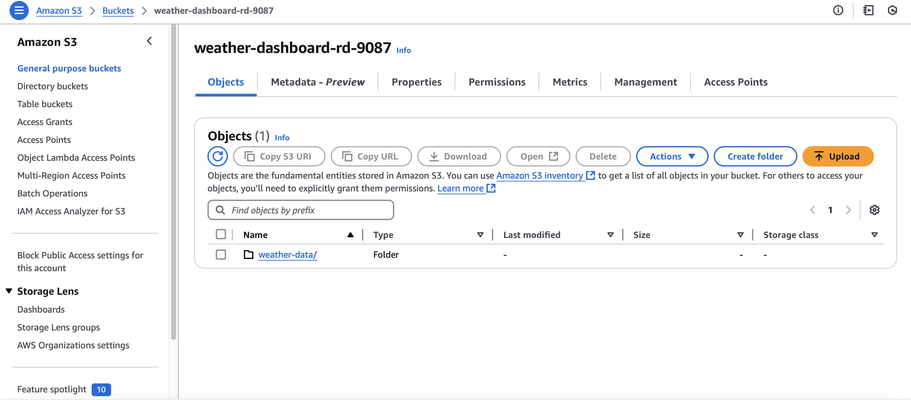
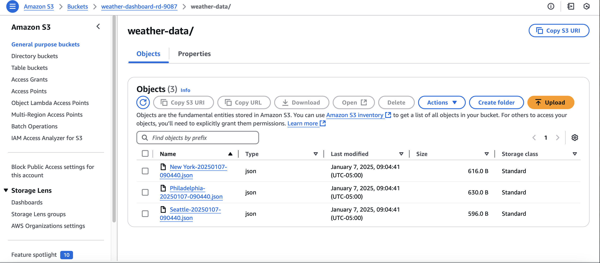

# **DevOps 30-Day Challenge | Day 1 | Weather Dashboard App**

# **Weather Data Dashboard System Using AWS S3 and OpenWeather API**

Overview:

This project demonstrates a scalable and efficient Weather Data Dashboard System built with AWS services, Python, and the OpenWeather API. The system is designed to collect, store, and manage real-time weather data, and can be easily extended to include additional features like data analysis and reporting. This project emphasizes key DevOps principles such as automation, cloud integration, version control, and Python development skills.

Key Features:

Real-Time Weather Data Dashboard:
Fetches up-to-date weather information for multiple cities worldwide from the OpenWeather API.

Detailed Weather Insights:
Provides real-time weather conditions, including temperature (°F), humidity levels, and current weather status.

Cloud Storage Integration (AWS S3):
Automatically stores weather data securely in AWS S3, ensuring scalability and reliability for long-term data retention.

Multi-City Tracking:
Tracks weather conditions across various cities globally, ideal for applications requiring real-time updates for multiple locations.

Historical Data Tracking:
Stores timestamped data entries in S3 for easy retrieval and analysis, helping to build a historical weather dataset for trend analysis.

# **Technical Architecture**:

Programming Language: Python 3.x
Cloud Provider: AWS (S3 for storage)
External API: OpenWeather API for weather data retrieval
Core Dependencies:

boto3: AWS SDK for Python to interact with AWS services.
python-dotenv: Secure management of environment variables.
requests: Simplified HTTP requests for seamless API integration.
Version Control: Git for source code management.
Project Structure:

bash
Copy code
weather_data_dashboard_system/
├── src/
│   ├── weather_dashboard.py        # Main application script
│   └── utils.py                    # Utility functions (e.g., data processing)
├── requirements.txt                # Project dependencies
├── .env                            # Environment variables
├── README.md                       # Project overview and instructions
└── .gitignore                      # Git ignore configuration
Setup Instructions:

# **Clone the Repository**:

Begin implementing the code in your integrated development environment (IDE) of choice (e.g., VSCode).

Ensure Python 3.x is installed on your system and create a Python virtual environment to isolate dependencies.

bash
Copy code
weather-dashboard/
├── src/
│   ├── __init__.py
│   ├── weather_dashboard.py
├── tests/
├── data/
├── .env
├── .gitignore
├── requirements.txt
Install the Required Dependencies:

Install the Python dependencies listed in the requirements.txt file:

bash
Copy code
pip install -r requirements.txt
Configure Environment Variables:

Clone the repository to your local machine:

bash
Copy code
git clone https://github.com/your-username/weather-data-dashboard-system.git
cd weather-data-dashboard-system
Create and activate a virtual environment, then configure the .env file in the root directory with your OpenWeather API key and AWS S3 bucket name:

bash
Copy code
OPENWEATHER_API_KEY=your_api_key
AWS_BUCKET_NAME=your_bucket_name
Configure AWS CLI Credentials:

Set up your AWS CLI credentials:

bash
Copy code
aws configure
Provide your AWS Access Key ID, Secret Access Key, region, and output format when prompted.

Run the Application:

Launch the weather data dashboard application:

bash
Copy code
python src/weather_dashboard.py
The application will fetch weather data from the OpenWeather API, store it in the configured S3 bucket, and print detailed weather insights to the console.

# **Code Explanation**:

weather_dashboard.py:

Fetches weather data from the OpenWeather API using the API key stored in the .env file.
Collects and processes weather data for various cities and stores it in AWS S3 using boto3.
Timestamps each data entry to track historical weather conditions.
Prints weather data (temperature, humidity, conditions) to the console for real-time monitoring.
utils.py:
Contains helper functions for data parsing, API requests, and error handling to ensure smooth operation of the application.

# **Scalability and Improvements**:

Data Analysis and Reporting:
Future iterations could incorporate data analysis tools to generate weather reports or visualize trends based on historical data stored in S3.

Alert System:
Implement a weather alert system (using AWS SNS or Lambda) to notify users when certain weather thresholds (e.g., severe storms) are met.

Expanded Cloud Integrations:
Extend the architecture to use AWS services like Lambda for scheduled data retrieval and AWS RDS or DynamoDB for structured data storage.

Conclusion:

This project showcases the seamless integration of external API data, cloud storage, and automation best practices. It serves as a practical example of applying DevOps principles using Python and AWS, which are essential skills for building scalable and maintainable cloud-based applications. This project can serve as the foundation for more advanced systems involving weather data analysis, reporting, and alerting.

